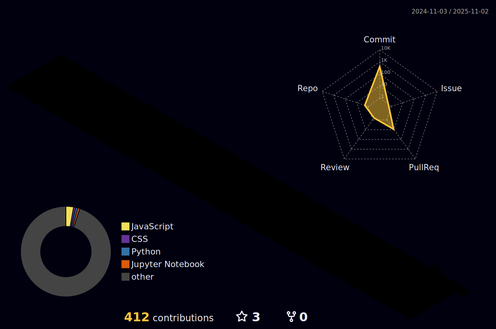

-------

<!-- 

    
    

 -->

## 👋 Introduction
* Jeongwon Lee (이정원)
* Master Program in Chung-Ang University

## 📖 Interest
* Image Segmentation
* Design Lightweight Model

## 🎓 Education
* `2024.03 - ` : M.S. in Department of Artificial Intelligence, Chung-Ang University, Korea
* `2018.03 - 2024.02` : B.S. in Computer Science, Semyung University, Korea (4.41/4.5) (***Summa cum laude***)

## 📞 Contact

    
    

 

<!--
**Woni0204/Woni0204** is a ✨ _special_ ✨ repository because its `README.md` (this file) appears on your GitHub profile.

Here are some ideas to get you started:

- 🔭 I’m currently working on ...
- 🌱 I’m currently learning ...
- 👯 I’m looking to collaborate on ...
- 🤔 I’m looking for help with ...
- 💬 Ask me about ...
- 📫 How to reach me: ...
- 😄 Pronouns: ...
- ⚡ Fun fact: ...
-->
